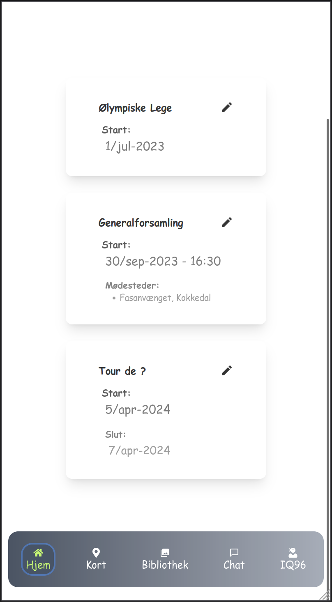

# IQ96 web app

A webapp for IQ96 on tour

## __Login__  

## __Reset password__   
 

## __Events__  
News about upcoming events 

## __Map__ 
Where the user can add new markers and they will be sorted according to type

## Technologies

- Typescript
- React
- Next v13.4 (server components / app folder)
- Firebase
- Deployed using vercel.com
- leaflet

## Installation

### `npm install`

Before running project:
Use file `.env.template` to add environment values. For instance values from your firebase console for connecting to this cloud DB.

## Available Scripts

In the project directory, you can run:

### `npm run dev`

Runs the app in the development mode.\
Open [http://localhost:3000](http://localhost:3000) to view it in your browser.

Or build and run using

### `npm run build`
### `npm run start`
